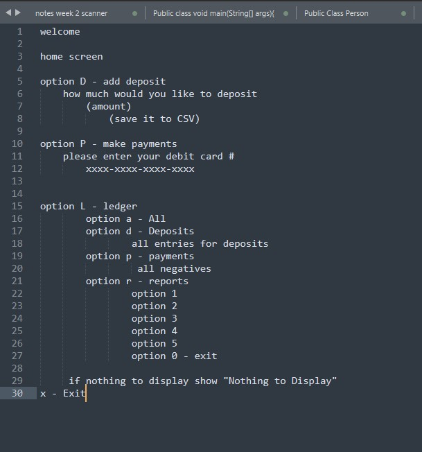
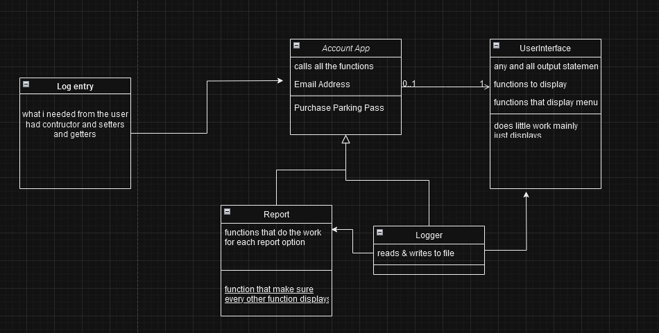
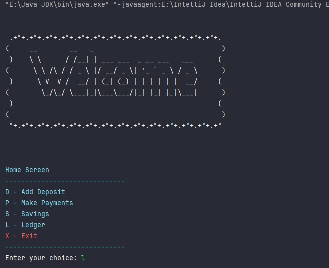
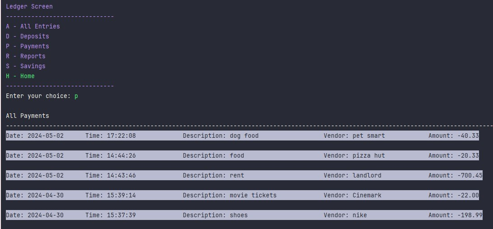
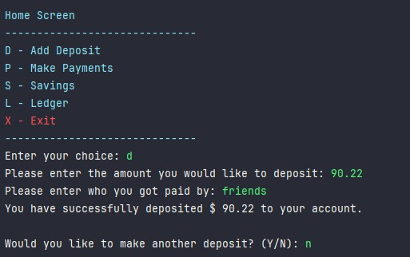
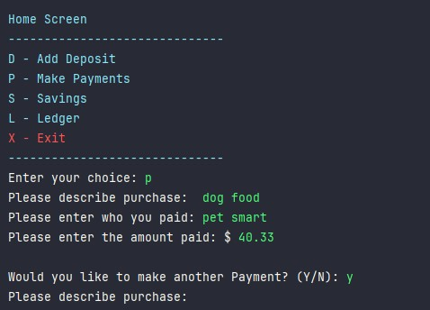
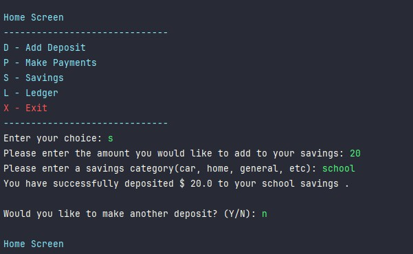
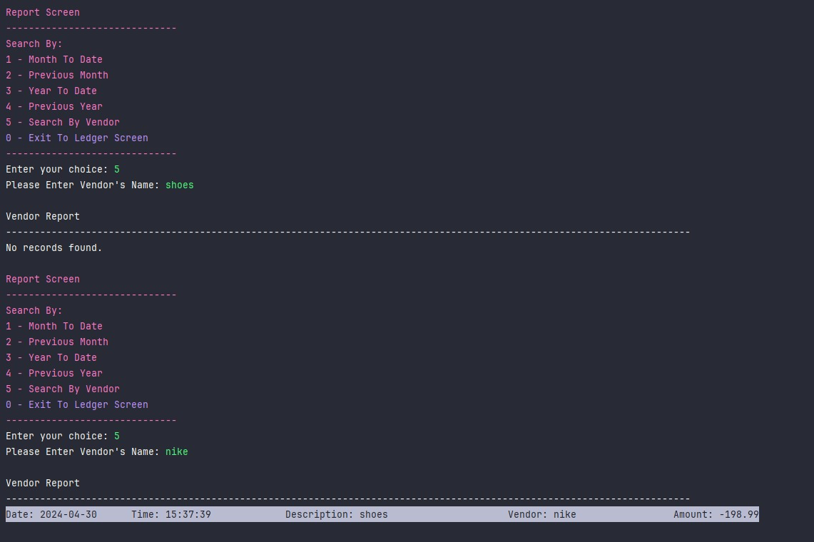
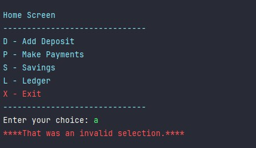
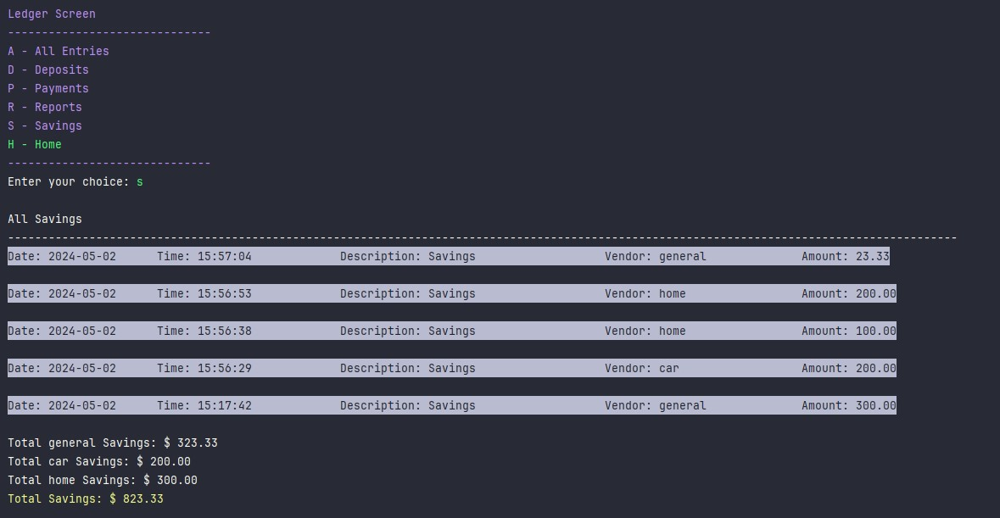

# AccountingLedger

### What is the Personal Account Ledger?
This personal account ledger keeps track of all your deposits and payments, as well as, your savings by category. 
It also displays varies types of reports with detailed information about the data that was entered. It will list the date, time, short description, vendor name, and amount that was entered. 


## Process
> Beginning stages: an idea on how I wanted my display to function/look like



>This diagram I used heavily to see how I wanted to structure my classes. 
I would also do pseudo code on my notebook to get a better idea of my methods or what direction I wanted to go with.




## Screenshots

> How each display looks and waht the outcome should be. As well as an example of invalid input. 
















## Code 
> `Report` Class has all the methods that return a new List within the specified criteria 
```java
   public class Report
{
        private static final LocalDate currentDate = LocalDate.now();


        private static List<LogEntry> filterEntriesByDate(List<LogEntry> logEntryList, LocalDate start, LocalDate end)
        {
                return logEntryList.stream().filter(entry-> !entry.getDate().isBefore(start)
                        &&!entry.getDate().isAfter(end)).collect(Collectors.toList());
        }

        public static List<LogEntry> monthToDate(List<LogEntry> logEntries)
        {
                LocalDate firstOfMonth = currentDate.withDayOfMonth(1);
                return filterEntriesByDate(logEntries, firstOfMonth, currentDate);
        }

       etc...

        // one method to display them
        public static void reportResults(List<LogEntry>logEntries)
        {
                Collections.reverse(logEntries);
                for(LogEntry entry : logEntries){

                        System.out.println(entry);
                }
                if(logEntries.isEmpty())
                {
                        System.out.println("No records found.");
                }
        }

}
```


>**Interest Piece:** One piece I enjoyed implementing was the savings menu option. I thought it would be pretty simple to implment but then realized I wanted to include the total for each category. For example, if you're saving for a house it would show you the total savings you've contributed for the house savings. Since, I didn't have much experience with hashmap it was a bit tough to implement but luckily it works as intended!

```java
public void displaySavings()
    {
        HashMap<String, Double> savingsMaps = new HashMap<>();
        System.out.println("\nAll Savings");
        System.out.println("-".repeat(140));
        ArrayList<LogEntry> logEntries = logger.readEntries();
        Collections.reverse(logEntries);

        double total = 0;
        for (LogEntry savings : logEntries.stream().filter(entry -> entry.getDescription().
                        equalsIgnoreCase("Savings")).
                collect((Collectors.toList())))
        {
            double categoryTotal = savingsMaps.getOrDefault(savings.getVendor(), 0.0);
            categoryTotal += savings.getAmount();
            savingsMaps.put(savings.getVendor(), categoryTotal);

            System.out.println(savings);

            total += savings.getAmount();
        }

        for (Map.Entry<String, Double> entry : savingsMaps.entrySet()) {
            System.out.printf("Total " + entry.getKey() + " Savings: $ %.2f\n", entry.getValue());
        }
        System.out.printf(Colors.YELLOW + "Total Savings: $ %.2f\n" + Colors.RESET, total);

    }
```

> How the results are displayed:


